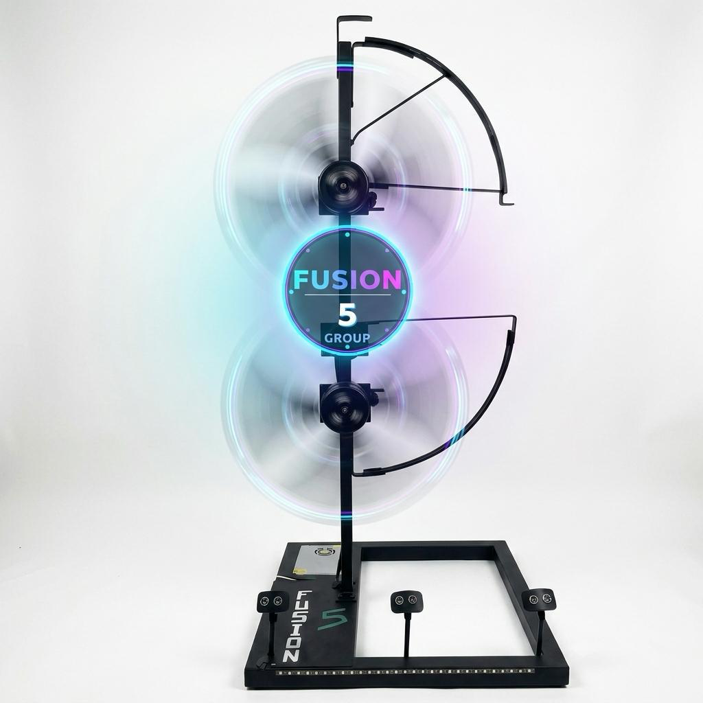

# Pioneering Volumetric 3D Holographic Spatial Display System



<p align="center">
  <b>Developed at the Faculty of Information Technology • University of Moratuwa</b>
  <br />
  A high-speed dual-rotor 2×1 vertical overlap volumetric 3D spatial light array with ESP32 microcontrollers, 50Hz ESC motor dynamics, Hall Effect phase sync, and ultrasonic sonar perimeter safety.
</p>

<p align="center">
  
  
  
  
  
</p>

---

## 📖 Executive Summary

**FUSION 5** is a volumetric 3D holographic spatial light display engineered at the **Faculty of Information Technology, University of Moratuwa**. 

Traditional 2D LED fans are limited by small circular viewing boundaries and isolated single-blade rotors. FUSION 5 solves this by arranging two high-speed rotating LED blades in a **2×1 vertical overlap configuration** with a **13cm center convergence zone**. By driving dual 2200KV brushless DC outrunner motors at **2400–3600 RPM**, the system writes light into mid-air, utilizing the human eye's **Persistence of Vision (POV)** phenomenon to render tall, continuous, three-dimensional spatial holograms.

---

## ⚡ Key Engineering Features

* 🌀 **Persistence of Vision (POV) Retinal Engine**: Converts 60 polar sectors × 100 addressable RGB LEDs into high-density 3D spatial models at 50Hz refresh rate.
* 🎛️ **Dual ESP32 Microcontroller Telemetry**:
  * **ESP32-S3-N16R8**: 240MHz dual-core processor handling high-speed 20MHz SPI LED data streaming and Cartesian-to-Polar matrix decoding.
  * **ESP32 Wi-Fi Motor Controller**: SoftAP wireless access point (`192.168.4.1`) streaming 50Hz ESC PWM throttle curves and WebSocket status updates.
* ⏱️ **Sub-Millisecond Hall Effect Interrupt Sync**: Hardware magnetic interrupts lock polar coordinate angles on every rotor revolution, eliminating phase jitter drift.
* ⚡ **50Hz ESC Pulse-Width Motor Control**: Precision servo PWM signal generation ($1000\mu\text{s} \text{ idle} \to 2000\mu\text{s} \text{ full throttle}$) regulating dual A2212 2200KV motors.
* 🛡️ **Triple HC-SR04 Ultrasonic Sonar Safety Shield**: Time-of-flight acoustic sensors continuously monitor a 180° perimeter safety arc with sub-30ms hardware interrupt emergency motor cutoff.
* 🎨 **Invisigrid Web Telemetry Console**: Modern glassmorphic React control application with live canvas particle backgrounds, polar matrix image conversion, 3D geometry model visualization, and firmware explorers.
* 🕒 **Live Holographic Clock Generator**: Realtime 60 FPS ticking clock with seconds sweep hand, 12-Hour/24-Hour military formats, 5 digital number font styles (JetBrains Mono, Orbitron, Digital HUD Share Tech, Arcade VT323 Pixel, Russo Heavy), and 40%–180% display scale control.
* 📝 **Custom Spatial Text Projection Engine**: Live mid-air text projection with 5 font style families (Orbitron Sci-Fi, Outfit Modern, JetBrains Mono Cyber, Russo Heavy Impact, Cinzel Holographic Serif), 16px–140px font size slider, and 40%–180% spatial scale control.
* 🏛️ **Official University of Moratuwa Emblem Logo**: Bundled high-resolution crest logo asset (`uom.png`) rendering instantly on initial canvas load.

---

## 📊 System Architecture & Specifications Benchmark

| Specification Parameter | FUSION 5 Dual POV System | Legacy Commercial 2D SpinDisplay |
| :--- | :--- | :--- |
| **Array Configuration** | **2×1 Vertical Overlap (13cm overlap)** | Single Isolated Circular Fan |
| **Microcontroller MCU** | **Dual ESP32-S3-N16R8 (240MHz Dual Core)** | 8-bit Single Core MCU |
| **LED Protocol** | **APA102-2020 (SPI 12–20MHz Clock)** | Slow Shift Register LEDs |
| **Rotor Speed** | **2400 – 3600 RPM (50Hz Frame Rate)** | Fixed 1200 RPM |
| **Polar Resolution** | **60 Polar Sectors × 100 Radial LEDs** | 30 Sectors × 48 LEDs |
| **Binary Buffer Format** | **12,000 Byte RGB565 Array Payload** | Proprietary Encrypted Format |
| **Interactive Studio Modes** | **Image/Video, Live Clock & Custom Text** | Static Pre-rendered Images Only |
| **Safety System** | **Triple HC-SR04 Ultrasonic Sonar Radar** | None / Plastic Shield Only |
| **Control Interface** | **Open Web REST + WebSockets Console** | Windows Desktop Executable Only |

---

## 🔌 Hardware Pinout & Circuit Diagram

```
                 +-----------------------------------+
                 |         ESP32-S3 CONTROLLER       |
                 +-----------------------------------+
                 | GPIO 18 ----> ESC 1 PWM Signal    |
                 | GPIO 19 ----> ESC 2 PWM Signal    |
                 | GPIO 23 ----> Hall Sensor 1 Int   |
                 | GPIO 22 ----> Hall Sensor 2 Int   |
                 | GPIO 13 ----> APA102 SPI Clock    |
                 | GPIO 12 ----> APA102 SPI Data     |
                 |                                   |
                 | GPIO 25 ----> Sonar 1 TRIG        |
                 | GPIO 26 ----> Sonar 1 ECHO        |
                 | GPIO 27 ----> Sonar 2 TRIG        |
                 | GPIO 14 ----> Sonar 2 ECHO        |
                 | GPIO 32 ----> Sonar 3 TRIG        |
                 | GPIO 33 ----> Sonar 3 ECHO        |
                 +-----------------------------------+
```

---

## 💻 Web Console Application Features

The web application ([https://fusion5-hologram-array-system.vercel.app](https://fusion5-hologram-array-system.vercel.app)) provides 8 dedicated interactive modules:

1. 🔬 **Lab Overview**: Real-time interactive 3D hardware rig cover presentation with cyan laser scanlines, radar overlays, and dual-fan physics breakdown.
2. 🎛️ **Live Controller**: Cyber Command dashboard for master throttle control, individual ESC channel pulsing, safety override switches, and live ultrasonic clearance telemetry.
3. 🎨 **Hologram Array Studio**: Multi-mode spatial converter supporting 3 rendering suites:
   * 🖼️ **Image & Video Mode**: Transforms graphics/GIFs into 12,000-byte RGB565 polar binary matrices with University of Moratuwa emblem logo as default asset.
   * 🕒 **Live Hologram Clock Mode**: Realtime 60 FPS ticking clock with seconds sweep hand, 12h/24h toggle, 5 digital digit font styles (*JetBrains, Orbitron, Digital HUD, Arcade VT323, Russo Heavy*), and 40%–180% scale control.
   * 📝 **Custom Text Mode**: Mid-air spatial text generator with 5 font style families (*Orbitron, Outfit, JetBrains Mono, Russo Heavy, Cinzel*), font size slider (16px to 140px), and spatial scale control (40% to 180%).
4. 📐 **3D Geometry Viewer**: Interactive Three.js spatial canvas rendering mathematical wireframe models (Holographic Torus, Wireframe Cube, DNA Double Helix, Cyber Ring).
5. ⚡ **Electronics Architecture**: Bento Circuit Grid detailing dual ESP32-S3 MCUs, APA102 LED SPI lines, A2212 motors, and HC-SR04 sonar safety.
6. 📘 **Build Guide**: Step-by-step engineering documentation covering frame assembly, motor mounting, ESC calibration, and firmare flashing.
7. 💻 **Firmware Code Explorer**: Full C++ source code viewer for ESP32 firmware with syntax highlighting and inline logic explanations.
8. 👥 **Engineering Team & Gallery**: Final project evaluation showcase featuring high-res field photography and individual engineer profiles.

---

## 👥 Engineering Team & Academic Credits

**Faculty of Information Technology • University of Moratuwa**

* 👨‍💻 **Raniru** — *Firmware & Embedded Systems Lead*
* 👨‍💻 **Ravindu** — *Project Lead & Hardware Systems Engineer*
* 👨‍🔧 **Nesandu** — *Mechanical Design & Structural Specialist*
* 👩‍💻 **Pavani** — *Polar Matrix Algorithms & Data Engineer*
* 👩‍🔬 **Janani** — *Perimeter Safety & Quality Assurance Lead*

---

## 🚀 Quick Start & Local Setup

```bash
# 1. Clone the repository
git clone https://github.com/Ravindu200324511398/Pioneering-Volumetric-3D-Holographic-Spatial-Display.git

# 2. Enter project directory
cd Pioneering-Volumetric-3D-Holographic-Spatial-Display

# 3. Install dependencies
npm install

# 4. Launch local development server
npm run dev

# 5. Build production bundle
npm run build
```

---

## 🌐 Live Web Application & Repository Links

* 🐙 **GitHub Repository**: [github.com/Ravindu200324511398/Pioneering-Volumetric-3D-Holographic-Spatial-Display](https://github.com/Ravindu200324511398/Pioneering-Volumetric-3D-Holographic-Spatial-Display)
* ⚡ **Live Vercel Production Web App**: [fusion5-hologram-array-system.vercel.app](https://fusion5-hologram-array-system.vercel.app)

---

<p align="center">
  <b>FUSION 5 • Faculty of Information Technology • University of Moratuwa</b>
</p>
